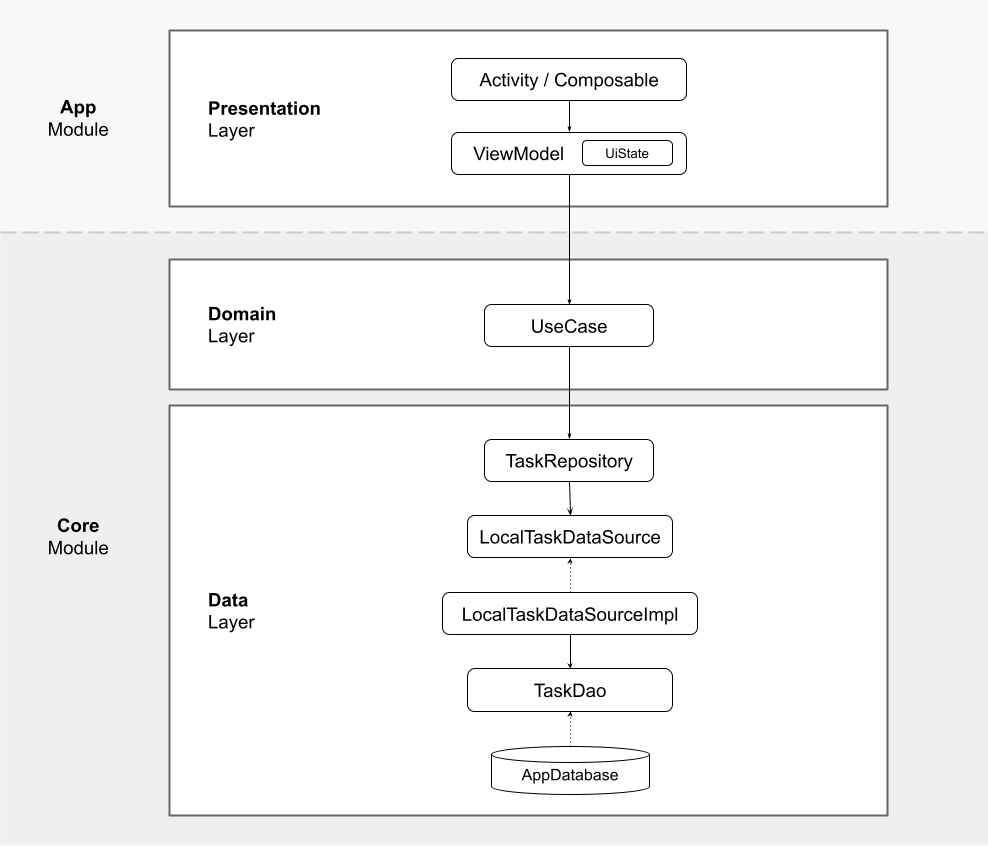

# Doit

## Description

This is a simple app that lets users organize their tasks in an easy way. It has been written
entirely in Kotlin by using the new UI framework, Jetpack Compose.

## Requirement

To run the app you need [Android Studio Chipmunk](https://developer.android.com/studio) and JDK 11
installed on your computer.

## Architecture

The app has been built following best practices and recommendations stated in Google's
official [Guide to app architecture](https://developer.android.com/topic/architecture). The code is
organized into two modules and three layers:

### Modules

Since the app has been created for academic purposes, focused on the process of building UI with
Jetpack Compose, we decided to encapsulate the business logic into a single module called Core that
provides data to the App module. The latter holds the presentation layer and will be our workspace
during the workshop.

### Layers

1. **Presentation:** The presentation layer holds the implementation of the screens. Its role is to
   display the data provided by the layers below on the screen and serve as the primary point of
   user interaction.
2. **Domain:** The domain layer encapsulates the app business logic. It works like a bridge between
   the data layer and the presentation one. Use cases reside here.
3. **Data:** The data layer handles the data of the app. It's made of repositories that interact
   with different data sources.

## Dependencies

- [Jetpack Compose](https://developer.android.com/jetpack/compose): Android’s modern toolkit for
  building native UI, with less code and intuitive Kotlin APIs.
- [Navigation component](https://developer.android.com/jetpack/compose/navigation): Jetpack library
  that enables navigating from one destination within your app to another, along specific routes.
- [Hilt](https://d.android.com/hilt): dependency injection library for Android that reduces the
  boilerplate of doing manual dependency injection in your project.
- [Kotlin Coroutines](https://developer.android.com/kotlin/coroutines?gclid=Cj0KCQjwrJOMBhCZARIsAGEd4VHHTIZn0IQaxOlwjCXPBpoyuWflxN5mVvGkt9XsoGj8gJU4VnEnJdQaAoYwEALw_wcB&gclsrc=aw.ds):
  Recommended solution for asynchronous programming on Android.
- [Room](https://developer.android.com/jetpack/androidx/releases/room): Persistence library that
  provides an abstraction layer over SQLite.
